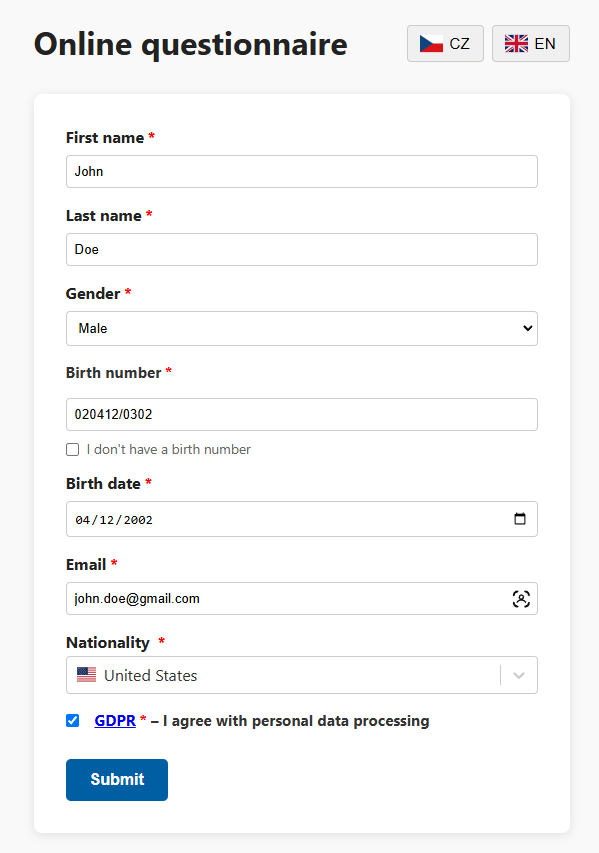
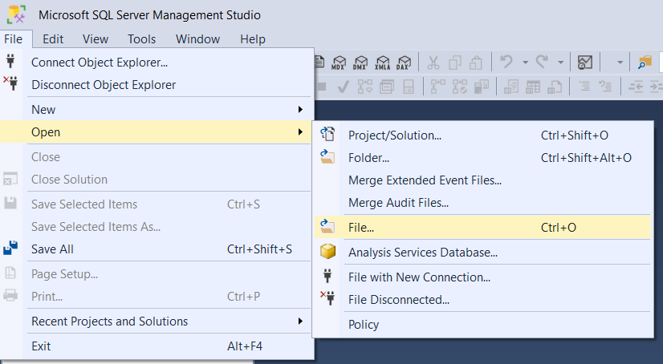
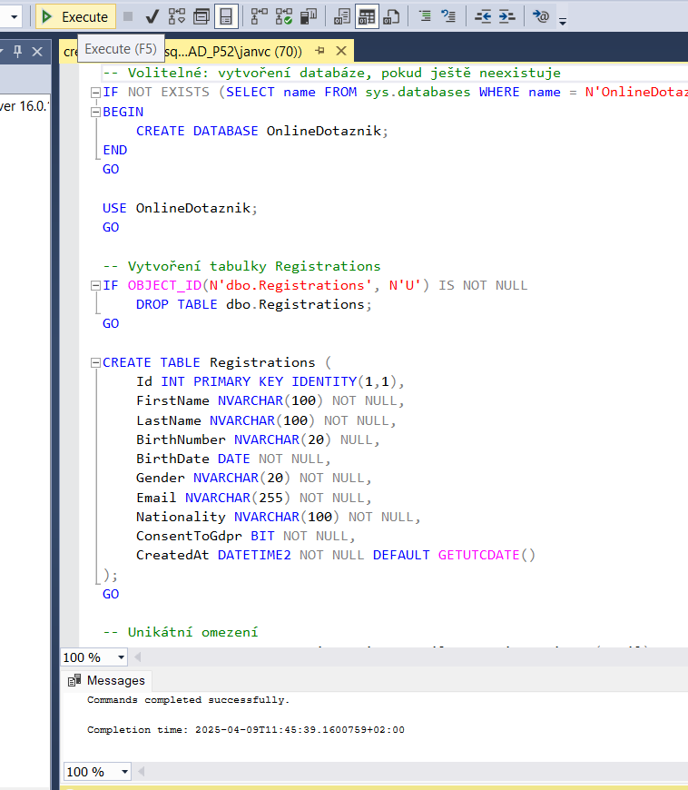
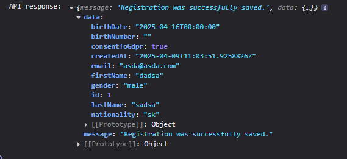

# Online Questionnaire (Online Dotazník)

- Last updated: 9.4.2025  
- Project using ASP.NET backend with pre-compiled React + TS frontend

<div style="display: flex; align-items: flex-start;">
   
   </div>

## Table of Contents
- [Prerequisites](#prerequisites)
- [Setup](#setup)
- [Frontend](#frontend)
- [Output](#output)
---
## Prerequisites

- Visual Studio
- .NET SDK 8.0
- Microsoft SQL Server
- SQL Server Management Studio (or alternative like Azure Data Studio)
- `Node.js for building frontend`

## 🛠️ Setup

1. Download or clone the project and open the `.sln` in **Visual Studio**  
2. Make sure `OnlineDotaznik.API` is set as the **Startup project**
3. **Create the database**:
   - Open **SQL Server Management Studio** (or any alternative)
   - Connect to your local SQL Server
   - Right-click `Databases` → **New Query**
   - Open `create_database.sql` from the `OnlineDotaznik.API` folder

	<div style="display: flex; align-items: flex-start;">
   
   </div>
   <br>
   - Press <b>Execute</b>
   <div style="display: flex; align-items: flex-start;">
   
   </div>

4. Run the project in Visual Studio 
- <b>You may be prompted to create a self-signed certificate</b> in order for the ASP.NET to run properly. This is standard and you must <b>proceed</b> so the project can be run. 
- The prebuilt frontend will open in your browser

---

## 🌐 Frontend

- React (with TypeScript) + Vite project
- Prebuilt version is embedded in `OnlineDotaznik.API/wwwroot` => can be deleted if you want to work actively in React
- Full source is located in `/frontend` (not part of `.sln`)
- Configurations: prepared in `.env` and `.env.production`

If you want to edit and rebuild the frontend:

```bash
cd frontend
npm install
npm run build
```
---

## Output

- Record is checked and recorded in the Db
<div style="display: flex; align-items: flex-start;">
   
   </div>
<br>

- The response is returned as JSON and printed to the browser console
<div style="display: flex; align-items: flex-start;">
   
   </div>
   
